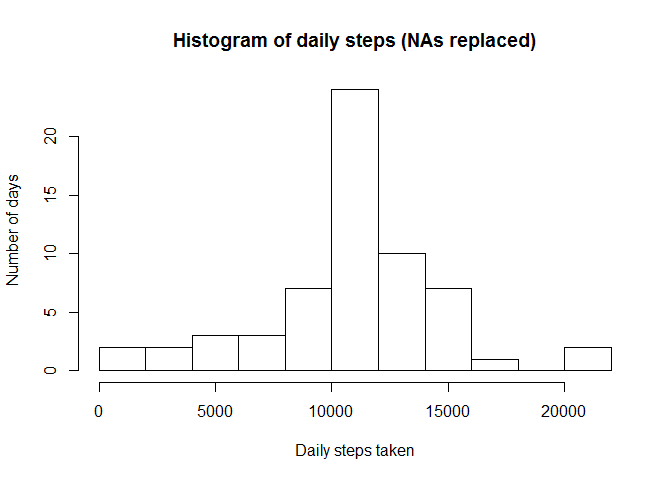

# Reproducible Research: Peer Assessment 1
Gergely Kiss  
Saturday, February 14, 2015  

## Loading and preprocessing the data
Loading and formatting the original data into a data frame. Date coloumns are converted to an appropriate type.


```r
data <- read.csv("activity.csv", header=TRUE)
data$date <- as.Date(data$date)
```

Daily steps histogram:


```r
steps <- aggregate(x=data$steps, by=list(data$date), FUN="sum")
names(steps) <- c("date", "steps")
steps$date <- as.Date(steps$date)
```

The histogram shows the daily steps in 10 ranges

```r
hist(steps$steps, breaks=10, xlab="Daily steps taken", ylab="Number of days", main = "Histogram of daily steps")
```

 


## What is mean total number of steps taken per day?
Mean of the total number of steps taken per day:


```r
mean(steps$steps, na.rm=TRUE)
```

```
## [1] 10766.19
```


Median of the total number of steps taken per day:


```r
median(steps$steps, na.rm=TRUE)
```

```
## [1] 10765
```


## What is the average daily activity pattern?


```r
interval <- aggregate(x=data$steps, by=list(data$interval), FUN=mean, na.rm=TRUE)
names(interval) <- c("interval", "averagesteps")
barplot(interval$averagesteps, xlab="Intervals", ylab="Average steps")
```

 

Interval with the highest average step rate:


```r
interval[which.max(interval$averagesteps),1] 
```

```
## [1] 835
```


## Imputing missing values

The total number of missing values in the dataset:


```r
sum(is.na(data$steps))
```

```
## [1] 2304
```

I substitute the missing ("NA") values with the average number of steps taken in the same interval during the whole measurement period


```r
nonadata <- data
for (i in 1:nrow(data)) {
  if (is.na(data[i,1])) {
    nonadata[i,1] <- interval[which(interval[,1] == nonadata[i,3]) ,2]
  }
}
```

Histogram of the new data set:


```r
nonasteps <- aggregate(x=nonadata$steps, by=list(data$date), FUN="sum")
names(nonasteps) <- c("date", "steps")
nonasteps$date <- as.Date(nonasteps$date)
hist(nonasteps$steps, breaks=10, xlab="Daily steps taken", ylab="Number of days", main = "Histogram of daily steps (NAs replaced)" )
```

 

Mean of the total number of steps taken per day without NAs


```r
mean(nonasteps$steps)
```

```
## [1] 10766.19
```


Median of the total number of steps taken per day without NAs


```r
median(nonasteps$steps)
```

```
## [1] 10766.19
```

There is no big difference between the original and the "expanded" data set. Since I filled the missing fields with the mean values, the sum median became the same as the mean

## Are there differences in activity patterns between weekdays and weekends?

For displaying multiple plots in one figure, I use the multiplot function. 
Source: http://www.cookbook-r.com/Graphs/Multiple_graphs_on_one_page_(ggplot2)/


My system is non-english, so I set the system variables to english for my reviewers to understand the weekend names:


```r
Sys.setlocale("LC_TIME", "C")
```

```
## [1] "C"
```

```r
library(ggplot2)

nonadata$weekday <- 0

for (i in 1:nrow(nonadata)) {
  if ((!weekdays(nonadata[i,2]) %in% c('Saturday','Sunday'))) {
    nonadata[i,4] <- 1
  }
}


intervalwd <- aggregate(x=nonadata[nonadata$weekday==1,1], by=list(nonadata[nonadata$weekday==1,3]), FUN=mean, na.rm=TRUE)

intervalwe <- aggregate(x=nonadata[nonadata$weekday==0,1], by=list(nonadata[nonadata$weekday==0,3]), FUN=mean, na.rm=TRUE)

names(intervalwd) <- c("interval", "steps")
names(intervalwe) <- c("interval", "steps")


plotwd <- qplot(interval, steps, data = intervalwd, geom="line") + ggtitle("5 minutes activity on weekdays")
plotwe <- qplot(interval, steps, data = intervalwe, geom="line") + ggtitle("5 minutes activity on weekends")

multiplot(plotwd, plotwe)
```

```
## Loading required package: grid
```

 
